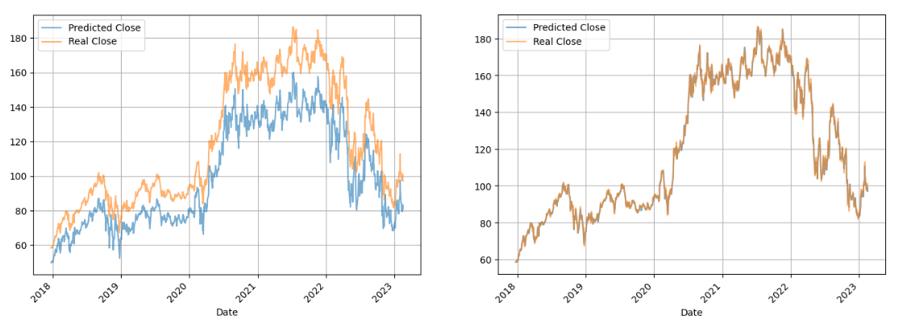

# Amazon Stock Price Forecasting

## Introduction

The goal of this project is to predict Amazon's future stock price from historical data, specifically using a daily time interval split. We want to know how Amazon's stock price will change in the future based on its past performance. This information can help investors make informed decisions about buying or selling Amazon stock.

Our goal was to develop a model that can learn from the real-time data stream and make accurate predictions about the future stock price. The model should be able to adapt to changing market conditions and adjust its predictions accordingly, using incremental learning models.

All the code and the specific details about the development (dataset analysis, feature extraction...) can be followed step-by-step in the provided [notebook](forecasting.ipynb).

## Methodology

We have compared a traditional batched approach with an incremental one (also known as stream or online learning). We observed that the latter is much more flexible to the intrinsic fluctuations of the stock price, while the batch approach is extremely affected by concept drifts.

The key difference between batch learning and incremental learning is that in the first the model is trained with a fix dataset and is used after the training to predict new values. On the other hand, incremental learning merges the training and the prediction in the same step: the model learns with its own predictions, overtime. Therefore, the latter can adapt to new changes, while the former is constrained to the original training dataset distribution.

For this experiment, we have trained the batched model with 80% of the data and left the other 20% to test, while the incremental model uses all the data to train and test.

## Results

A total of 5 different predictive models have been tested: Bayesian regression, Hoeffding Trees (HT), Hoeffding Adaptive Trees (HAT), Multi-Layer Perceptrons (MLP) and KNNs. The Root Mean Squared Error (**RMSE**) for the best hyperparameter configuration of each model is presented below:

| Model    | Batch   | Incremental |
|----------|---------|-------------|
| Bayesian | 20.2099 | **0.6489**  |
| KNN      | 75.9289 | 7.4794      |
| HT       | 78.0528 | 15.8706     |
| HAT      | 102.484 | 9.1886      |
| MLP      | 33.6471 | 3.0874      |

To visualize the superiority of the incremental approach (right) over the traditional one (left) we include the predicted forecast by the Bayesian regression:

